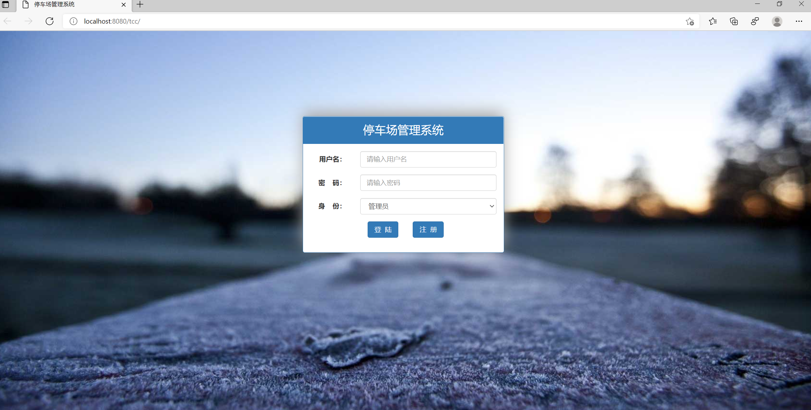
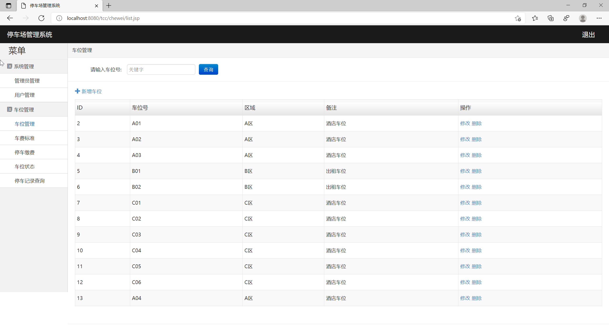
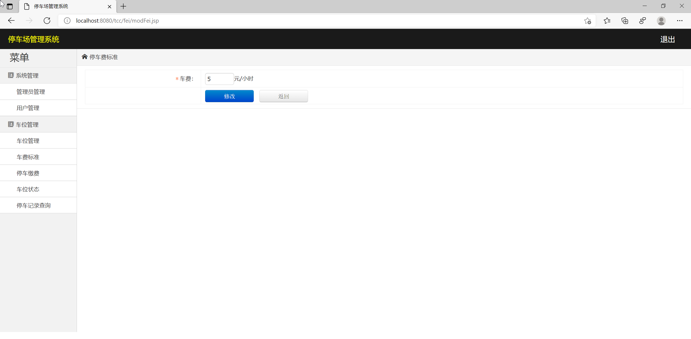
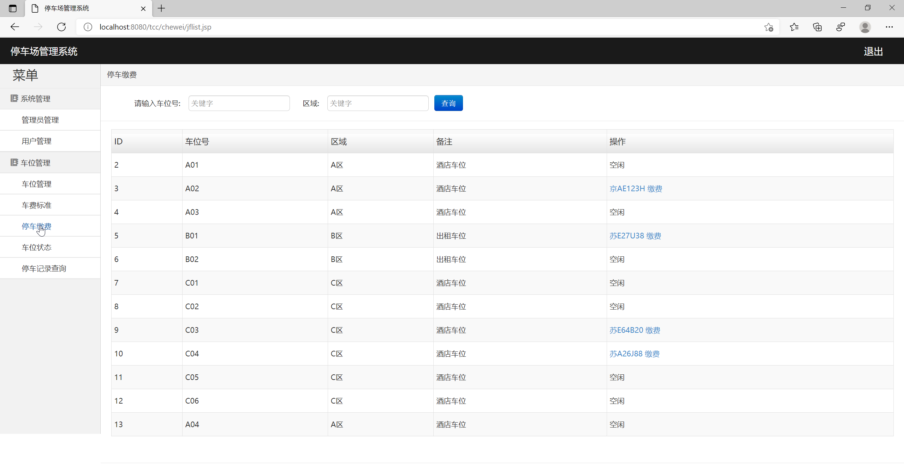
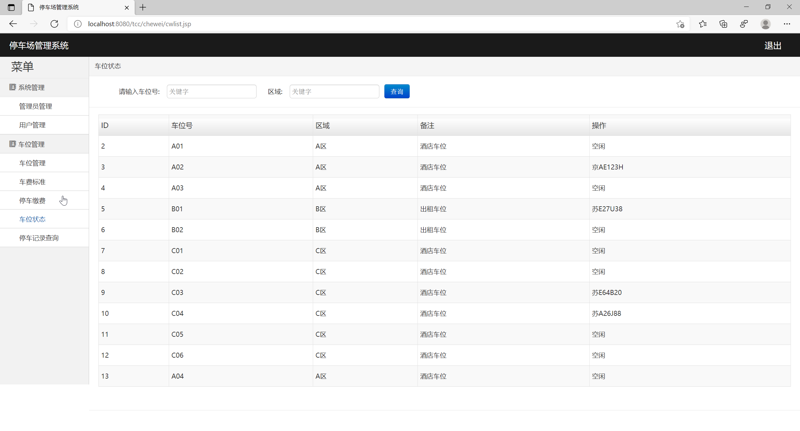
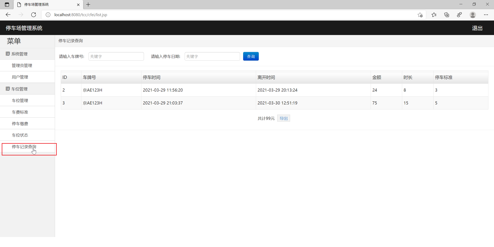
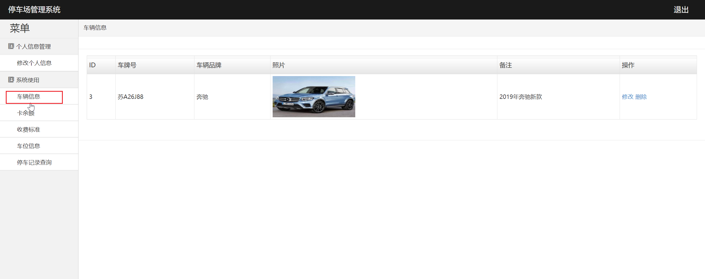

<h1 align="center">基于JSP+Servlet的停车场管理系统</h1>

 获取sql文件 QQ: 605739993 QQ群: 377586148 

 [个人站点: 从戎源码网](https://armycodes.com/)

## 简介

> 本代码来源于网络,仅供学习参考使用!
>
> 提供1.远程部署/2.修改代码/3.设计文档指导/4.框架代码讲解等服务
>
> 前端首页: http://localhost:8080/tcc
>
> 管理员: admin 密码: admin
>
> 用户: zhangsan 密码: 123
> 

## 项目介绍

基于JSP+Servlet的停车场管理系统：前端 JSP、BootStrap、JQuery、Ajax，后端 Servlet，系统角色分为：用户和管理员。本项目是一套基于JSP+Servlet的停车场管理系统，采用B/S结构，使用JAVA开发语言，结合JSP技术，以MySQL作为后台数据库。主要功能如下：

### 管理员：

- 基本操作：登录、修改密码、修改密码、重置其他账号密码、注册、导出excel
- 管理员管理：筛选管理员、添加管理员信息、修改管理员信息、删除管理员、获取管理员列表、查看管理员详情
- 用户管理：筛选用户、添加用户信息、修改用户信息、删除用户、获取用户列表、查看用户详情、充值
- 车位管理：筛选车位信息、添加车位信息、获取车位信息列表、查看车位信息详情、删除车位、修改车位信息
- 车费标准管理：设置停车费标准
- 停车缴费管理：获取停车缴费列表、筛选停车缴费信息、停车缴费
- 车位状态管理：获取车位状态列表、筛选车位状态信息
- 停车记录管理：获取停车记录列表、筛选停车记录信息、导出excel

### 用户：

- 基本操作：登录、获取个人信息、修改个人信息、注册、余额查询
- 车辆信息：筛选车辆信息、获取车辆信息列表、查看车辆信息详情、修改车辆信息、删除车辆信息
- 收费标准：收费标准查询
- 车位信息：筛选车位信息、获取车位信息列表、查看车位信息详情、预订车位、停车
- 停车记录查询：获取停车记录列表

## 环境

- <b>IntelliJ IDEA 2020.3</b>

- <b>Mysql 5.7.26</b>

- <b>Tomcat 7.0.108</b>

- <b>JDK 1.8</b>

## 运行截图

